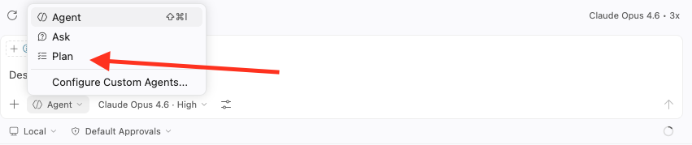

# Exercise 01 — From Specs to Running App

## What You'll Do

The core idea behind agentic development is simple: **scope first, build second.** Instead of writing code yourself and asking the agent to help along the way, you write precise specifications and let the agent build the entire implementation from them. The better your specs, the better the output.

In this exercise you'll experience that firsthand. Inside the [`weather-app/docs/`](../../weather-app/docs/) folder you'll find two specifications for **SkyLog** — a Python API that tracks weather conditions for saved locations using the Open-Meteo API:

- [`SPEC.md`](../../weather-app/docs/SPEC.md) — the product specification: what the API does, its endpoints, request/response contracts, and how weather conditions are derived.
- [`TECH_SPEC.md`](../../weather-app/docs/TECH_SPEC.md) — the technical specification: stack choices, project structure, module responsibilities, database schema, and conventions.

You'll read these specs, hand them to GitHub Copilot, and watch it build a working app — then verify everything runs.

### At a Glance

1. [Read the specs](#1-read-the-specs)
2. [Set up the environment](#2-set-up-the-environment)
3. [Build the app with the agent](#3-build-the-app-with-the-agent)
4. [Run and verify](#4-run-and-verify)
5. [Run the tests](#5-run-the-tests)

## Prerequisites

- [Main prerequisites](../../README.md#prerequisites) completed

---

## Steps

### 1. Read the specs

Before touching any code, open both spec files and skim through them. This is the **scoping** step — the part that makes agentic development work. You're not memorizing details; you're building a mental model of what the agent is about to build so you can evaluate its output.

> **Tip:** You don't need to understand every line. Focus on the big picture: four API endpoints, a SQLite database for persistence, and the Open-Meteo API as the data source.

<details>
<summary>What to pay attention to</summary>

- **SPEC.md** defines the API contract — endpoints, request/response shapes, weather condition mapping, and error handling.
- **TECH_SPEC.md** defines the implementation — FastAPI + SQLModel + httpx, the folder layout, how each module is responsible for one thing, and how to run/test it.

Together they give the agent everything it needs. That's the point.

</details>

### 2. Set up the environment

Create a virtual environment inside the `weather-app/` folder:

```bash
cd weather-app
python -m venv .venv
source .venv/bin/activate  # macOS/Linux
# or
.venv\Scripts\activate     # Windows
```

### 3. Build the app with the agent

Open GitHub Copilot Chat in VS Code (`Cmd+Shift+I` on macOS / `Ctrl+Shift+I` on Windows/Linux). Before prompting, switch to **Plan mode** using the mode selector at the bottom of the chat panel:



> **Why plan first?** When the task is large (like building an entire app), you want to see the agent's approach before it starts. Plan mode tells the agent to propose a plan for your review before writing any code — letting you catch misalignments early, approve the direction, or course-correct. It's a habit worth building.

Also check which **model** is selected in the model picker (top of the chat panel). Here's a quick guide:

| Model | Strengths | Best for |
|---|---|---|
| **Claude (Sonnet/Opus)** | Most disciplined at following multi-step instructions and long specs. Thorough, careful output. | Agentic tasks like "read these specs and build everything" |
| **GPT-4o** | Fast generalist. Good at conversational tasks and quick edits. | Short questions, smaller code changes |
| **Auto** | VS Code picks the model per request based on task complexity. | Everyday use when consistency isn't critical |

> **For this workshop:** pin to **Claude Sonnet** so everyone gets consistent behavior from the same prompts. Auto mode may route different attendees to different models, making it harder to follow along.

**Prompt:**

```
Read @SPEC.md and @TECH_SPEC.md in weather-app/docs/.
Build the SkyLog application following these specifications exactly.
Create all files, folders, and the requirements.txt as defined in the tech spec.
```

The agent will produce a plan. Review it — does it match what you read in the specs?

<details>
<summary>What to look for in the plan</summary>

- Does it create the folder structure from TECH_SPEC.md (`app/`, `app/routers/`, `app/services/`, `tests/`)?
- Does it pick the right stack (FastAPI, SQLModel, httpx, pydantic-settings)?
- Does it plan to create all four endpoints across the router files?
- Does it mention persisting location data to SQLite?

If something looks off, reject the plan and refine your prompt. If it looks good, approve it and let the agent build.

</details>

### 4. Run and verify

Once the agent finishes, install dependencies and start the server:

```bash
pip install ".[dev]"
uvicorn app.main:app --reload
```

Open [http://localhost:8000/docs](http://localhost:8000/docs) in your browser — you should see the Swagger UI with all four endpoints.

Try adding a location from the terminal:

```bash
curl -s -X POST http://localhost:8000/locations \
  -H "Content-Type: application/json" \
  -d '{"city": "San Francisco", "country_code": "US"}'
```

You should get back a JSON response with weather data from the Open-Meteo API.

### 5. Run the tests

```bash
pytest
```

If any tests fail, don't fix them yourself — ask the agent:

```
The tests are failing. Read the test output and fix the issues.
Follow the conventions in docs/TECH_SPEC.md.
```

This is part of the workflow: the agent broke it, the agent fixes it.

---

## Checkpoint

By the end of this exercise you should have:

- [ ] A running FastAPI app at `http://localhost:8000`
- [ ] Four working endpoints: `POST /locations`, `POST /locations/import`, `GET /locations`, `GET /reports/summary`
- [ ] A SQLite database that stores location and weather data
- [ ] Passing tests

---

## Key Takeaways

- **Specs as code.** The specs live in `docs/` alongside the code. They're the source of truth for both you and the agent. The more precise they are, the less back-and-forth you'll need.
- **Plan before you build.** Asking the agent to plan first lets you review its approach before it writes a single line. Use it for large tasks; skip it for smaller, well-defined ones.
- **The agent reads your project.** It doesn't need you to explain what's already built. It reads the filesystem and fills in what's missing based on the spec.

---

## Next Up

You've got a working app built entirely from specs. But the agent also generated a README, and it's... fine. In the next exercise you'll learn how to teach the agent your standards using **Agent Skills**.

[Continue to Exercise 02 — Agent Skills →](../02%20-%20skills-intro/README.md)
