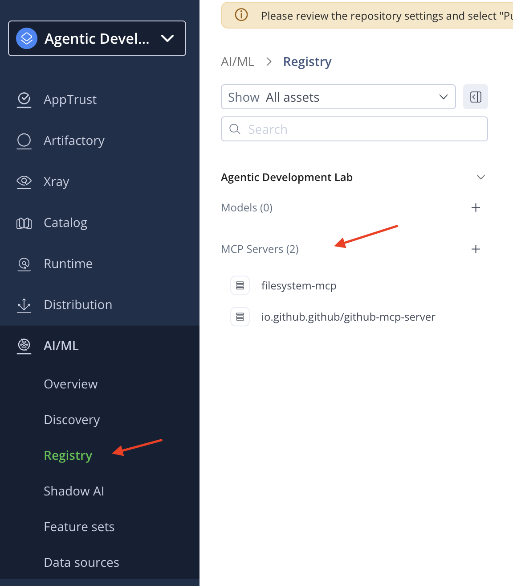
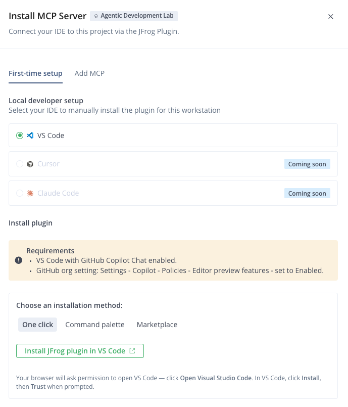
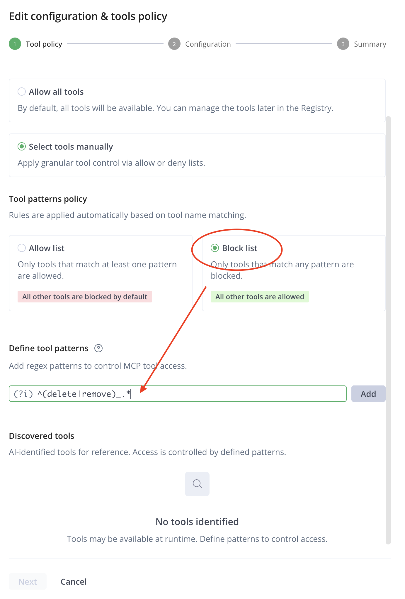
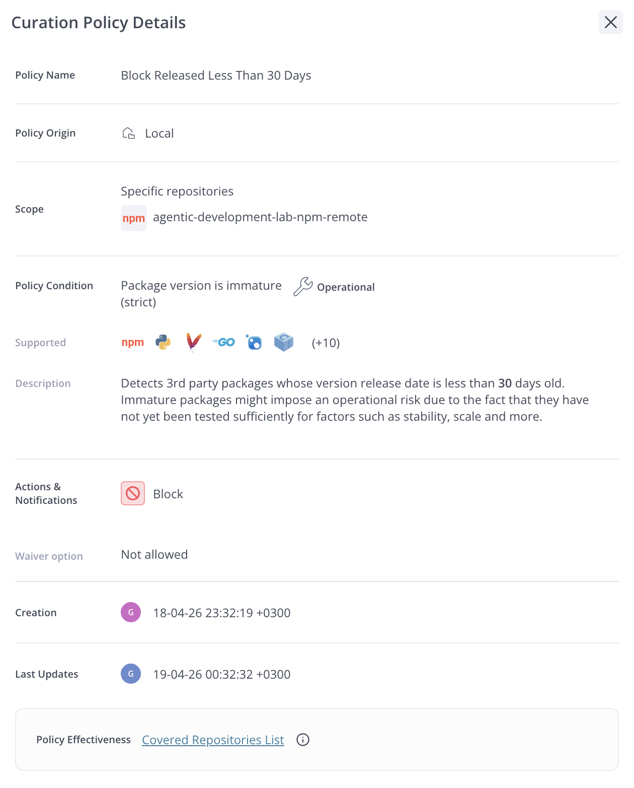

# Exercise 05 — MCP Governance

## What You'll Do

In Exercise 04 you installed MCP servers the way most developers do today — the agent picked an npm package, used `@latest`, stored credentials in a local JSON file, and exposed every tool the server offers. It worked, but it was ungoverned.

In this exercise you'll replace that setup with the **JFrog MCP Registry**. You'll install the same two MCP servers — filesystem and GitHub — but this time through the **JFrog Plugin for VS Code** and its **Agent Guard** feature, which governs versions, credentials, and tool access. By the end you'll have a concrete side-by-side comparison.

**Estimated time:** 20-25 minutes

### At a Glance

1. [Clean up Exercise 04](#step-1--clean-up-exercise-04)

**Install the JFrog Plugin (Steps 2-4)**

2. [Open the MCP Registry](#2-open-the-mcp-registry)
3. [Install the JFrog Plugin for VS Code](#3-install-the-jfrog-plugin-for-vs-code)
4. [Understand what the plugin does](#4-understand-what-the-plugin-does)

**Goal A — Filesystem MCP (Steps 5-8)**

5. [Install the filesystem MCP](#5-install-the-filesystem-mcp)
6. [Check the available tools](#6-check-the-available-tools)
7. [Use it](#7-use-it)
8. [Notice the version](#8-notice-the-version)

**Goal B — GitHub MCP (Steps 9-11)**

9. [Install the GitHub MCP](#9-install-the-github-mcp)
10. [Use it](#10-use-it)
11. [Notice the tool restrictions](#11-notice-the-tool-restrictions)

## Prerequisites

- [Main prerequisites](../../README.md#prerequisites) completed
- Your JFrog subscription includes the **AI Catalog** entitlement — Agent Guard checks this at session start and stays dormant without it


---


## Step 1 — Clean up Exercise 04

Before setting up the Registry, remove the MCP servers from Exercise 04.

Prompt the agent:

```
Remove all MCP servers from this project's configuration.
Clear the .vscode/mcp.json file.
```

Verify:

- `.vscode/mcp.json` is empty or contains only `{}`
- **MCP: List Servers** from the Command Palette no longer shows the filesystem or GitHub servers

> The MCP packages installed via `npx` in Exercise 04 are cached globally in `~/.npm/_npx/`, not in the project directory. Without the config in `mcp.json`, they're inert — VS Code won't launch them. If you want to reclaim disk space, run `npm cache clean --force`.

> In Exercise 04, credentials were stored in plaintext in that file. Treat `.vscode/mcp.json` like `.env` and keep sensitive values out of version control.


---


## Steps 2-4 — Install and Verify the JFrog Plugin

&nbsp;

### 2. Open the MCP Registry

In the JFrog Platform, first select the **Agentic Development Lab** project from the project picker in the top navigation bar. Then navigate to **AI/ML > Registry > MCP Servers**.



&nbsp;

### 3. Install the JFrog Plugin for VS Code

The [JFrog Plugin for VS Code](https://github.com/jfrog/vscode-plugin) is the official JFrog plugin for VS Code and **GitHub Copilot Chat**. It connects your Copilot agent to the JFrog Platform with policy-governed MCP access, auto-installed governance instructions, and **Agent Guard** — the feature you'll use to discover, install, configure, update, and remove MCP servers approved for your project in the JFrog AI Catalog.

You have three install options — pick whichever fits your workflow:

**Option 1 — Magic link (recommended).** Click **Install MCP** on any available MCP server in the Registry, select **VS Code** as your IDE, and click **Install via magic link**. Or paste this into your browser:

```
vscode://chat-plugin/install?source=jfrog/vscode-plugin
```

**Option 2 — Command Palette.** Run **Chat: Install Plugin from Source** (`Cmd+Shift+P` / `Ctrl+Shift+P`) and enter `https://github.com/jfrog/vscode-plugin/`.

**Option 3 — Marketplace setting.** Add this entry to your user `settings.json` (**Preferences: Open User Settings (JSON)**):

```json
"chat.plugins.marketplaces": [
  "https://github.com/jfrog/vscode-plugin/"
]
```

Then open the Extensions panel (`Cmd+Shift+X`), search for `@agentPlugins jfrog/vscode-plugin`, and click **Install**.

Whichever option you choose, VS Code prompts you to **Trust** the source — accept it.

This installs a **Copilot chat plugin** — not a traditional VS Code extension. It has no UI, no sidebar panel, and no settings page. (Don't confuse it with `JFrog.jfrog-vscode-extension` on the VS Code Marketplace — that's JFrog's separate dependency-scanning extension and has nothing to do with Agent Guard.)



After installing, **restart VS Code entirely** (not just the chat panel — the plugin's session hooks need a full restart to activate).

> **Note:** The plugin resolves credentials from the environment variables `JFROG_URL` (your platform URL, e.g. `https://<WORKSHOPINSTANCE>.jfrog.io` — no trailing `/`) and `JFROG_ACCESS_TOKEN`, falling back to your JFrog CLI configuration. If you have neither, run `jf config add` in your terminal and follow the prompts. Optionally set `JF_PROJECT` to your project key so the agent doesn't have to ask for it. Restart VS Code after configuring.

> **Org-managed Copilot?** If your Copilot access is managed by a GitHub organization, an admin must set **Settings → Copilot → Policies → Editor preview features** to **Enabled**, or VS Code won't load chat plugins. Individual Copilot accounts can skip this.

&nbsp;

### 4. Understand what the plugin does

The plugin ships two components:

1. **A remote JFrog MCP server** — auto-attached to every session via the plugin's `.mcp.json`, pointing at `${JFROG_URL}/mcp` (OAuth — no API keys in config). This gives the agent JFrog Platform tools out of the box.
2. **Agent Guard** — a session-start hook. Each time a Copilot session starts, the hook verifies Agent Guard is enabled for your platform and injects the [MCP-management instructions](https://github.com/jfrog/vscode-plugin/blob/main/plugin/templates/jfrog-mcp-management.md) directly into the session context. Nothing is written into your workspace — the governance travels with the session.

The injected instructions ensure that when you ask the agent to install an MCP, it:

1. Queries the JFrog MCP Registry for the servers approved for your project (`npx @jfrog/agent-guard --list-available`)
2. Inspects the approved server's live catalog metadata — exact package name, version, required configuration, and tool policies
3. Writes an MCP config entry that launches the server through `npx @jfrog/agent-guard` — a local proxy that wraps the real MCP server and enforces tool policies on every call

Each governed MCP gets its own Agent Guard process and its own entry in your MCP config, listed individually in **MCP: List Servers** (e.g., `filesystem-mcp`) — not as a single "gateway" entry.

> **Where does the config go?** By default Agent Guard writes to your **user-level** MCP config (open it with **MCP: Open User Configuration**), so servers are available across workspaces and never committed to git. Phrase the request as "for this project" when you want the entry in the workspace `.vscode/mcp.json` instead — which is what this lab does.

Think about what this means: in Exercise 04, the agent wrote its own MCP configuration pointing directly at npm packages. Here, the injected instructions ensure the agent always routes through Agent Guard — and Agent Guard enforces tool policies at runtime.

Before continuing, ask the agent:

```
Which MCP servers are available for installation from the JFrog plugin?
```

The agent resolves your JFrog server — from `JFROG_URL` + `JFROG_ACCESS_TOKEN`, or from your JFrog CLI configuration via `jf config show` — and asks for your JFrog project. When it asks, provide the **project key** (not the display name): `agentic-development-lab`.

> **Important:** The agent's prompt says "project name" but the catalog API requires the **project key**. The project key is the hyphenated identifier (e.g., `agentic-development-lab`), not the human-readable name shown in the UI (e.g., "Agentic Development Lab"). Using the display name will fail. Setting the `JF_PROJECT` environment variable skips this question entirely.

Once you provide both, it runs the catalog lookup and lists the approved MCP servers — for this lab: `filesystem-mcp` and `io.github.github/github-mcp-server`.


---


## Goal A — Filesystem MCP (local, governed)

In Exercise 04 you installed the Filesystem MCP directly from npm. Now you'll install it through Agent Guard and see what's different: which version gets installed, which tools are exposed, and why.

&nbsp;

### 5. Install the filesystem MCP

Prompt the agent:

```
Install the filesystem MCP server for this project.
```

The agent installs the approved filesystem MCP through Agent Guard. If you're in a new chat session, it will ask for the JFrog server and project again — that's expected. Compare this to Exercise 04, where the agent chose whatever npm package it wanted.

Verify the install: run **MCP: List Servers** from the Command Palette (`Cmd+Shift+P` / `Ctrl+Shift+P`) or open `.vscode/mcp.json` — you should see a `filesystem-mcp` entry that launches through `npx @jfrog/agent-guard`.

&nbsp;

### 6. Check the available tools

Prompt the agent:

```
List all the tools available from the filesystem MCP server.
```

You should see the governed tool list — potentially a subset of what was available in Exercise 04. Agent Guard applies **tool policies** set by your project admin, so tools like `write_file` or `create_directory` may be restricted depending on the policy.



These permissions are configured centrally in the JFrog Platform — not in a local JSON file on each developer's machine.

&nbsp;

### 7. Use it

Prompt the agent:

```
List all Python files in this project using filesystem tools.
```

It works the same as Exercise 04 — but the setup behind it is completely different.

&nbsp;

### 8. Notice the version

The MCP server installed through Agent Guard is **not** `@latest`. It's a specific version that was resolved through Artifactory and passed your organization's curation policies.

One such policy is the **zero-day filter** — npm packages less than 30 days old are automatically blocked. This prevents the exact supply chain attack you saw in Exercise 04, where `@latest` could pull a freshly published (and potentially compromised) package.



In Exercise 04, every VS Code restart pulled whatever version was currently on npm. Here, the version is pinned, scanned, and governed.


---


## Goal B — GitHub MCP (remote, governed)

In Exercise 04 you pasted a GitHub token directly into the agent's chat, and it stored it in plaintext in `mcp.json`. Now you'll install the same GitHub MCP through Agent Guard — the token is declared as a **secret** in the catalog metadata, so the config only ever holds a `${input:...}` placeholder. VS Code prompts you for the value in a masked field, and the raw token never appears in the config file or the chat transcript.

&nbsp;

### 9. Install the GitHub MCP

Prompt the agent:

```
Install the GitHub MCP server.
```

The agent queries the catalog, finds `io.github.github/github-mcp-server`, and sees it requires an `Authorization` header. Because that value is marked **secret** in the catalog metadata, the agent doesn't take it in chat — it wires the header to a `${input:...}` placeholder in the MCP config, and VS Code prompts you for the value (masked) when the server starts. Enter it in the format `token ghp_...` (with the `token ` prefix).

Compare to Exercise 04, where the raw token you pasted into chat landed in plaintext in `.vscode/mcp.json`.

&nbsp;

### 10. Use it

Verify the agent is authenticated:

```
Use the GitHub MCP to tell me who I'm authenticated as.
```

The agent calls `get_me` and returns your GitHub username. Then try reading a public repo:

```
List the root contents of the jfrog/jfrog-cli repository using the GitHub MCP.
```

Then list some recent issues:

```
List the 3 most recent open issues on jfrog/jfrog-cli.
```

&nbsp;

### 11. Notice the tool restrictions

In Exercise 04, the raw GitHub MCP exposed every tool — including `create_issue`, `add_issue_comment`, `delete_branch`, `fork_repository`, and more. Through Agent Guard, the tool policy restricts the available tools to a governed subset.

Prompt the agent:

```
List all the tools available from the GitHub MCP server.
```

Compare the list to what you had in Exercise 04. Tools like `create_issue`, `add_issue_comment`, and `fork_repository` are not available — the admin has restricted write operations through the JFrog Platform's tool-level policies. The agent can read repositories, list issues, and browse contents, but cannot modify anything it shouldn't.


---


## Compare

### Before vs After

| | Exercise 04 (raw MCP) | Exercise 05 (Agent Guard) |
|---|---|---|
| **Package source** | `npx @latest` from npm — unvetted | Scanned and version-pinned from Artifactory |
| **Curation** | None — any version, any time | Zero-day filter blocks packages less than 30 days old |
| **Credentials** | Plaintext token in `.vscode/mcp.json` | Masked `${input:...}` prompt — never in chat, never raw in config |
| **Configuration** | Agent picks args, scope, env vars | Agent Guard configures from the catalog's approved metadata |
| **Tool control** | All tools exposed — `delete_branch`, `create_repository`, everything | Filtered to allowed tools per project policy |
| **Visibility** | Invisible JSON file on one developer's laptop | Centrally managed in JFrog Platform — admin sees all |


---


## Key Takeaways

- **The Registry is the governed alternative to npm.** MCP servers are scanned, versioned, and approved before developers can install them — the same model as package management through Artifactory.

- **Curation policies apply to MCP servers too.** The same zero-day filter that protects your npm dependencies also governs which MCP server versions can be installed. No more pulling unvetted `@latest` on every restart.

- **Agent Guard is the client-side enforcement point.** The JFrog Plugin injects governance instructions at session start and routes every install through the `@jfrog/agent-guard` proxy — the IDE-side surface of the JFrog AI Catalog's MCP Registry.

- **Credentials are handled as secret inputs.** Required credentials are declared in the MCP catalog metadata. VS Code prompts for them with a masked input and the config stores only a `${input:...}` reference — the raw value never lands in a file or the chat transcript.

- **Tool-level policies give admins control.** Agent Guard filters which tools each MCP server exposes, based on project policies. The agent only sees what it's allowed to use.

- **The agent experience doesn't change.** The agent still calls tools by name. The difference is that Agent Guard controls which tools exist, which versions run, and what credentials are used.

- **This completes the governance stack.** Skills are governed through the Skills Registry (Exercises 02-03). MCP servers are governed through the MCP Registry (Exercises 04-05). The agent operates freely within the boundaries your organization defines.
